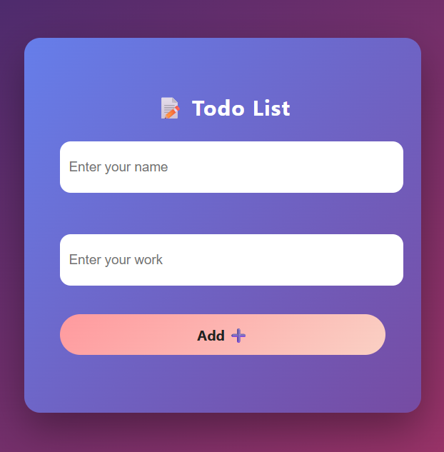
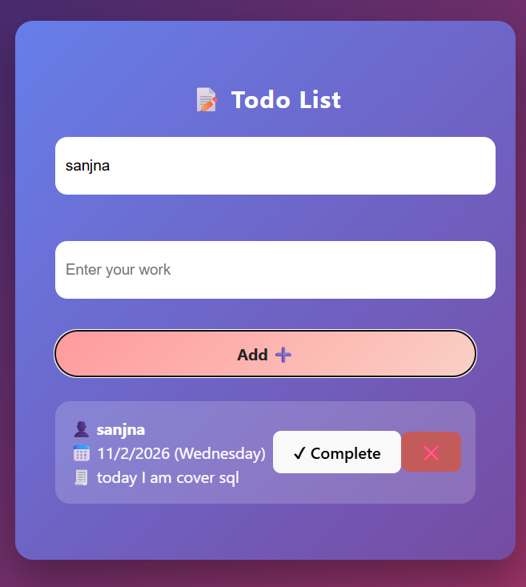

0
# 🚀 **Todo List App** - Your Ultimate Task Manager

  

Welcome to the **Todo List App**, a sleek and intuitive task management application built with **React** and **Vite**. This app empowers you to organize your daily tasks efficiently, track progress, and stay productive. Whether you're a freelancer, student, or professional, this tool is designed to make task management fun and effortless!

## ✨ **Features**

- **📝 Add Tasks**: Easily add tasks with your name, work description, date, and day.
- **✔️ Mark as Complete**: Complete tasks with a single click and see them crossed out.
- **🗑️ Delete Tasks**: Remove unwanted tasks instantly.
- **📅 Date & Day Tracking**: Automatically captures the current date and day for each task.
- **🎨 Responsive Design**: Works seamlessly on desktop and mobile devices.
- **⚡ Fast Performance**: Powered by Vite for lightning-fast development and builds.
- **🔒 User-Friendly**: Simple interface with alerts for incomplete inputs.

## 🖼️ **Screenshots**

Hover over the images to see a smooth zoom effect!

<div style="display: flex; justify-content: space-around; flex-wrap: wrap;">
  <div style="margin: 10px;">
    
    <p style="text-align: center; font-weight: bold; color: #333;">Main Interface</p>
  </div>
  <div style="margin: 10px;">
    
    <p style="text-align: center; font-weight: bold; color: #333;">Task Management View</p>
  </div>
</div>

## 🛠️ **Technologies Used**

- **Frontend**: React 19.2.0, Vite 7.2.4
- **Styling**: CSS (Custom styles in App.css and index.css)
- **Build Tool**: Vite
- **Linting**: ESLint
- **Icons**: Emojis for a fun touch! 😊

## 🚀 **Getting Started**

### Prerequisites
- Node.js (version 14 or higher)
- npm or yarn

### Installation

1. **Clone the repository**:
   ```bash
   git clone https://github.com/your-username/todo-list-app.git
   cd todo-list-app
   ```

2. **Install dependencies**:
   ```bash
   npm install
   ```

3. **Run the development server**:
   ```bash
   npm run dev
   ```
   Open [http://localhost:5173](http://localhost:5173) in your browser to view the app.

4. **Build for production**:
   ```bash
   npm run build
   ```

5. **Preview the production build**:
   ```bash
   npm run preview
   ```

## 📖 **Usage**

1. Enter your name and the task description.
2. Click **"Add ➕"** to add the task.
3. Mark tasks as complete by clicking **"✔ Complete"**.
4. Delete tasks using the **"❌"** button.
5. Enjoy a clutter-free task list!

## 🤝 **Contributing**

Contributions are welcome! Feel free to fork the repo, make changes, and submit a pull request. Let's build something amazing together! 🌟

## 📄 **License**

This project is licensed under the MIT License - see the [LICENSE](LICENSE) file for details.

## 📞 **Contact**

- **Developer**: sanjana
- **Phone**: 9919261458
- **Email**: sanjana081220@gmail.com

---

**Made with ❤️ by sanjana** | *Empowering productivity one task at a time!*
=======
# todoApp

